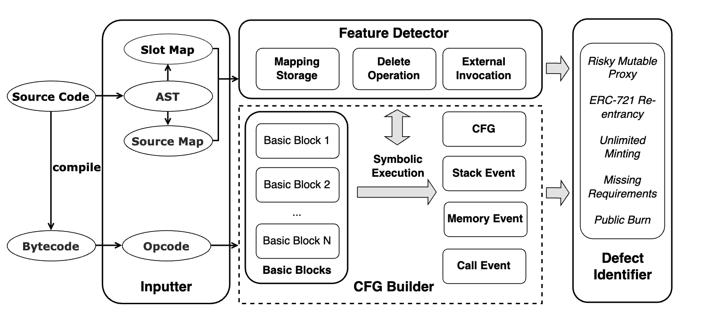
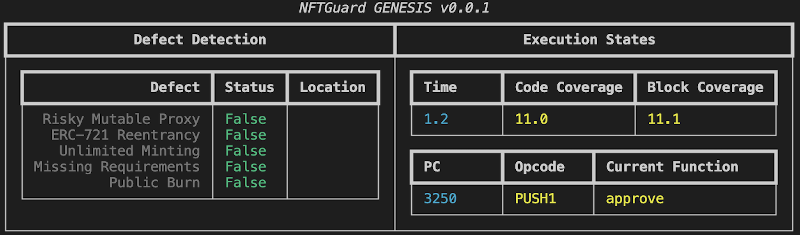
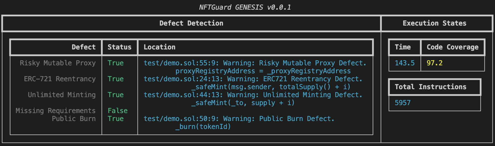

# NFTDefects


This is the repository of our work on the [Definition and Detection of Defects in NFT Smart Contracts](https://dl.acm.org/doi/10.1145/3597926.3598063).

## NFTGuard

The source code of our tool _*NFTGuard*_. A static analysis tool for detecting NFT-related contract defects based on a symbolic execution framework.

### Features

-   Specializing on 5 kinds of defects
    -   _Risky Mutable Proxy_
    -   _ERC-721 Reentrancy_
    -   _Unlimited Minting_
    -   _Public Burn_
    -   _Missing Requirements_
-   NFTGuard is also [extensible](https://github.com/enzymefinance/oyente/tree/master) for smart contracts with Solidity versions higher than _0.8.0_.

### Code Structure

The design refers to the architecture shown below:



-   `inputter`: **_Inputter_** module for compiling the source code of Solidity smart contracts and extracting useful information for further analysis before symbolic execution.
-   `cfg_builder`: **_CFG Builder_** module for analysis, including essential data structures, and symbolic execution of evm opcodes.
-   `feature_detector`: **_Feature Detector_** module of core analysis of finding NFT defects during execution based on 3 operational features (i.e., mapping storage, delete operation, and external invocation) and detection rules.
-   `defect_identifier`: **_Defect Identifier_** module of definition of classes of defect types, and reporter to show the detection results.
-   `test`: test demo for running NFTGurad.
-   `global_params.py`: global params for analysis.
-   `tool.py`: interfaces for input and output.
-   `requirements.txt`: required packages for running tool.

### Usage

1. Prepare requirements.

-   Python environment: please use Python 3.8, which is recommended (tested).
-   Python dependencies: please use pip to install dependencies in `requirements.txt`.

    ```shell
      $ pip3 install -r requirements.txt
    ```

-   `solc`: please use solc-select to install Solidity 0.8.16 (recommended) and switch to it.

    ```shell
      $ pip3 install solc-select==0.2.1
      $ solc-select install 0.8.16
      $ solc-select use 0.8.16
    ```

-   `evm`: please download version 1.10.21 (tested) from [go-ethereum](https://geth.ethereum.org/downloads) and add executable bins in the `$PATH`.

1. Demo test:

    ```shell
    $ python3 tool.py -s test/demo.sol -cnames token -j
    ```

    It would take minutes to show the result in the console, and there will be a json file to store the results in the same directory of the tested contract. Below image shows the output in the console.

    _Processing_
    
    _Result_
    

2. Docker run:
   You can also build docker and run with it.
    ```shell
    $ docker build -t nftdefects:v0.1 .
    ```
    Then run docker image.
    ```shell
    $ docker run -v test:/NFTGuard/test nftdefects:v0.1 -s test/demo.sol -cnames token -j
    ```

### defects_definition

The dataset that we use to define the 5 defects. The `defect_map.csv` stores the mapping relationship between inputs (i.e., posts and reports) and the 5 defect types.

### experiment

The results of our conducted experiments.

-   Comparison with the other 6 tools (with outputs of them).
    -   collected papers/tools and issue types they support to detect (see csv file).
    -   output of the tools.
-   Results of large-scale experiment on 16,527 NFT smart contracts.
-   Evaluation results of related experiments.
    -   labeled results on randomly sampled dataset with a confidence interval of 10 and a confidence level of 95% for **precision** and **false positives** evaluation.
    -   analysis of **false negatives** by the same sampling approach on contracts where no defect was reported.
-   Effectiveness evaluation of **proposed solutions** for each defect, which shows that after apply the suggested solutions, NFTGuard will not incorrectly report them.
